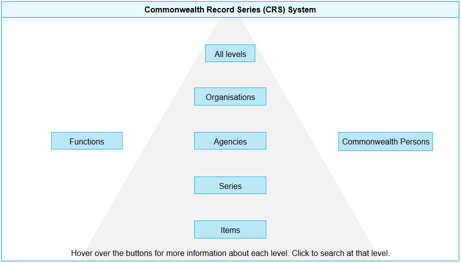

# Commonwealth Record Series system ontology

This ontology is an [OWL](https://www.w3.org/OWL/) interpretation of the Commonwealth Record Series (CRS) that is maintained by the [National Archives of Australia](http://naa.gov.au).

This ontology specialises classes and properties from the [Organization Ontology](https://www.w3.org/TR/vocab-org/).

It also reuses many components from the following Australian government ontologies:

* [Au Org Ontology](https://github.com/CSIRO-enviro-informatics/auorg-ont) - Australian government structures
* [AGRIF](http://reference.data.gov.au/def/ont/agrif) - Australian government Functions & Records

## The CRS System
The CRS system is...

**Figure 1**: The interactive diagram of the CRS from the [NAA website's Advanced Records Search](https://recordsearch.naa.gov.au/SearchNRetrieve/Interface/SearchScreens/AdvSearchMain.aspx), rendered here as a static image (not interactive).

## License
This ontology and all other content in this repository are licensed under the [Creative Commons Attribution 4.0 International (CC BY 4.0)](https://creativecommons.org/licenses/by/4.0/) (local copy of deed: [LICENSE](LICENSE)).

## Contacts
Creator:  
**Nicholas Car**  
*Senior Experimental Scientist*  
CSIRO Land & Water, Brisbane, Australia    
<nicholas.car@csiro.au>  
<http://orcid.org/0000-0002-8742-7730>  

Contributors:
  
**David Hearder**  
*a/g Assistant Director*  
Commonwealth Information Policy  
Collection Management  
National Archives of Australia  

**Simon Cox**  
*Research Scientist*  
CSIRO Land & Water, Melbourne, Australia    
<simon.cox@csiro.au>  
<http://orcid.org/0000-0002-3884-3420>  
