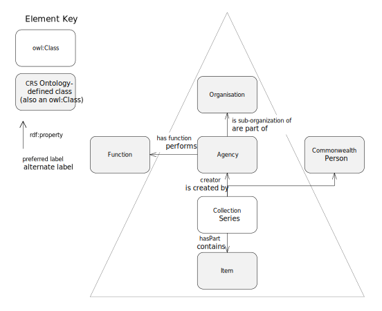
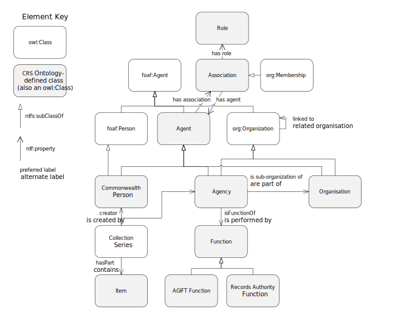

# Commonwealth Record Series system ontology

This ontology is an [OWL](https://www.w3.org/OWL/) interpretation of the Commonwealth Record Series (CRS) that is maintained by the [National Archives of Australia](http://naa.gov.au). It specialises classes and properties from the [Organization Ontology](https://www.w3.org/TR/vocab-org/) as well as several other ontologies, such as [Dublin Core](http://www.dublincore.org/documents/dcmi-terms/), to ensure that information in this ontology aligns with well-known models.

## The CRS System
The CRS system is described at the [National Archives of Australia's Records Search](https://recordsearch.naa.gov.au/SearchNRetrieve/Interface/SearchScreens/AdvSearchMain.aspx) website. The diagram of the CRS structure is given in Figure 1.

**Figure 1**: The interactive diagram of the CRS from the [NAA website's Advanced Records Search](https://recordsearch.naa.gov.au/SearchNRetrieve/Interface/SearchScreens/AdvSearchMain.aspx), rendered here as a static image (not interactive).

This ontology's interpretation of the CRS system, represented in a manner similar to that of Figure 1 for visual comparison, is given in Figure 2.

**Figure 2**: The main classes of this ontology echoing the layout of the CRS interactive diagram reproduced in Figure 1.

This ontology goes beyond the publicly available information on the CRS system and includes a couple of extra classes (such as `Association`) and also relates its classes to classes in well-known ontologies, for example, the CRS `Commonwealth Person` class is described as being a `sub class of` the [FOAF Vocabulary](http://xmlns.com/foaf/spec/)'s `Person` class.

The complete set of CRS ontology classes and their main relations and associations to other ontology's classes is shown in Figure 3.

**Figure 3**: The complete class diagram of this CRS Ontology

## Example Data
Data from the CRS system, modelled according to this CRC ontology is given in this repository in the [data/](data/) folder. The examples are presented as RDF (turtle format) files:

* **Commonwealth Person** - Paul Keating:
  * CRS record CP 665
  * RDF file: [CP665.ttl](CP665.ttl)
* **Agency** - Department of Northern Australia, Central Office:
  * CRS record CA 1889
  * RDF file: [CA1889.ttl](CA1889.ttl)

*NOTE: these examples are currently incomplete*

## License
This ontology and all other content in this repository are licensed under the [Creative Commons Attribution 4.0 International (CC BY 4.0)](https://creativecommons.org/licenses/by/4.0/) (local copy of deed: [LICENSE](LICENSE)).

## Contacts
Creator:  
**Nicholas Car**  
*Senior Experimental Scientist*  
CSIRO Land & Water, Brisbane, Australia    
<nicholas.car@csiro.au>  
<http://orcid.org/0000-0002-8742-7730>  

Contributors:

**David Hearder**  
*a/g Assistant Director*  
Commonwealth Information Policy  
Collection Management  
National Archives of Australia  

**Simon Cox**  
*Research Scientist*  
CSIRO Land & Water, Melbourne, Australia    
<simon.cox@csiro.au>  
<http://orcid.org/0000-0002-3884-3420>  
