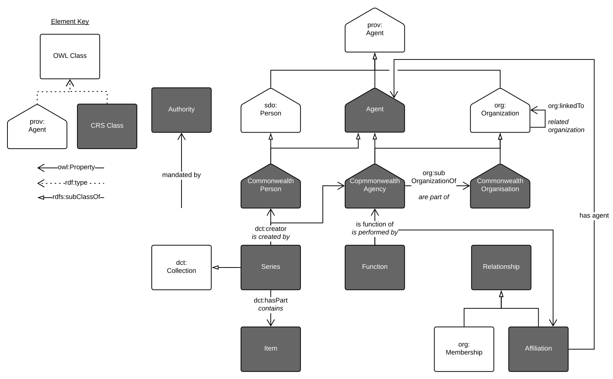

# Commonwealth Record Series system ontology

This ontology is an [OWL](https://www.w3.org/OWL/) interpretation of the Commonwealth Record Series (CRS) that is maintained by the [National Archives of Australia](http://naa.gov.au). It specialises classes and properties from the [Organization Ontology](https://www.w3.org/TR/vocab-org/) as well as several other ontologies, such as [Dublin Core](http://www.dublincore.org/documents/dcmi-terms/), to ensure that information in this ontology aligns with well-known, general, Semantic Web models.

This ontology is published online at its persistent URI namespace web address:

* **<http://linked.data.gov.au/def/crs>**

## The CRS System
The CRS system is described at the [National Archives of Australia's Records Search](https://recordsearch.naa.gov.au/SearchNRetrieve/Interface/SearchScreens/AdvSearchMain.aspx) website. The diagram of the CRS structure, as it is given within the Records Search, is reproduced here in Figure 1.

  
**Figure 1**: The interactive diagram of the CRS from the [NAA website's Advanced Records Search](https://recordsearch.naa.gov.au/SearchNRetrieve/Interface/SearchScreens/AdvSearchMain.aspx), rendered here as a static image (not interactive).

This ontology's interpretation of the CRS system, represented in a manner similar to that of Figure 1 for visual comparison, is given in Figure 2.

  
**Figure 2**: The main classes of this ontology echoing the layout of the CRS interactive diagram reproduced in Figure 1.

This ontology goes beyond the publicly available information on the CRS system and includes a couple of extra classes (such as `Relationship`) to assist with graph model methods of data delivery.

As per the original CRS, the link between a **Function** and an **Agency** is important, as this indicates both responsibility and funding.
Direct `crs:isPerformedBy` and the inverse `crs:performs` relationships capture the instantaneous state, or snapshot.
An indirect link, via an association-object from the class `crs:Relationship`, allows more information to be captured, such as the specific role of the agent, and in particular the time period during which the relationship applies, as shown in Figure 3.

**Figure 3**: The *Relationship* role *qualifying*, that it adding nuance to, the `crs:isPerformedBy`/`crs:performs` relationship.

Note that a `crs:Relationship` can pertain to any set of entities.
One specialisation is defined: `crs:Affiliation` which is between agents or parties, as per Figure 4.

**Figure 4**: the `crs:Affiliation` class, a specialisation of the `crs:Relationship` class that pertains to agents or parties only.

The complete set of CRS ontology classes and their main relations to other ontology's classes is shown in Figure 5.

  
**Figure 5**: The complete class diagram of this CRS Ontology

## Example Data
Data from the CRS system, modelled according to this CRC ontology is given in the [CRS Dataset - test](https://github.com/CSIRO-enviro-informatics/crs-dataset-test) repository.

## License
This ontology and all other content in this repository are licensed under the [Creative Commons Attribution 4.0 International (CC BY 4.0)](https://creativecommons.org/licenses/by/4.0/) (local copy of deed: [LICENSE](LICENSE)).

## Contacts
Publisher:  
**National Archives of Australia**  
<http://www.naa.gov.au>  

Creator:  
**Nicholas Car**  
*Senior Experimental Scientist*  
CSIRO Land & Water, Brisbane, Australia    
<nicholas.car@csiro.au>  
<http://orcid.org/0000-0002-8742-7730>  

Contributors:  
**Staff of the National Archives of Australia**  
*Information Governance Section*  
National Archives of Australia  
<information.governance@naa.gov.au>  

**Simon Cox**  
*Research Scientist*  
CSIRO Land & Water, Melbourne, Australia    
<simon.cox@csiro.au>  
<http://orcid.org/0000-0002-3884-3420>  
